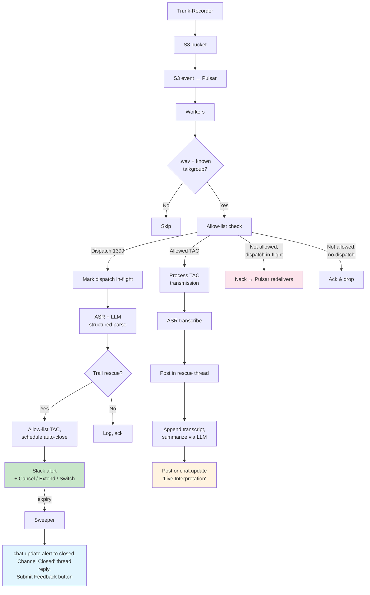

<h2 align="center">
  <!--  -->
  transcribe
</h2>
<h2 align="center">
  Radio-traffic monitoring for trail rescue: real-time transcription, AI-driven dispatch detection, live incident summarization, and Slack-native operator controls.
</h2>
<div align="center">

&nbsp;&nbsp;&nbsp;[Docker Compose][docker-compose-link]&nbsp;&nbsp;&nbsp;|&nbsp;&nbsp;&nbsp;[Slack interactivity][slack-interactivity-link]&nbsp;&nbsp;&nbsp;|&nbsp;&nbsp;&nbsp;[Contributing][contributing-link]&nbsp;&nbsp;&nbsp;|&nbsp;&nbsp;&nbsp;[GitHub][organization-link]

[![Made With Go][made-with-go-badge]][for-the-badge-link]

</div>

---

## Overview

`transcribe` watches NORCOM Fire Department radio traffic, identifies trail rescue
operations within seconds of dispatch, and posts a Slack alert with everything leadership
needs to act on. As the rescue plays out on a tactical channel, the service keeps a live
AI-generated interpretation of the situation in the rescue thread — updated after every
new TAC transmission with cumulative context — and lets authorized leadership control the
incident from Slack itself (cancel a false alarm, extend monitoring, or correct the AI's
TAC pick).

When the auto-close fires, the alert is rewritten in place to a closed state and a
feedback button opens a Google Form prefilled with the incident context.

### Key features

1. **Real-time radio transcription** — WAV files land in S3, the service picks them up via
   Pulsar, ships them to an ASR endpoint, and decides what to do based on the
   filename's talkgroup.
2. **Trail-rescue detection** — Fire Dispatch transcripts go through an OpenAI-compatible
   LLM with structured output, optionally constrained to a confidential call-types
   enum. When the model identifies a trail rescue, the assigned tactical channel
   (TAC1–TAC10) is auto-allow-listed for monitoring.
3. **Slack alert with operator controls** — leadership sees the rescue alert with three
   actions wired through Socket Mode: **Cancel** (false alarm), **Extend** (push the
   auto-close out), and **Switch TAC** (correct the LLM if it picked the wrong channel).
   All three are scoped to a configured user-ID allowlist.
4. **Live incident interpretation** — every TAC transmission triggers a structured
   summarization (headline, situation summary, location, units, patient status, outcome,
   key events) that updates a single thread message in place. Cumulative context: each
   refresh sees the full ordered transcript history.
5. **Auto-close lifecycle** — at expiry, the parent alert rewrites itself to a closed
   state (no buttons, status line replaced), a "Channel Closed" thread reply lands, and
   a Submit Feedback button optionally opens a Google Form prefilled with TAC, closed-at,
   dispatch transcript, and the latest AI summary.
6. **Resilient under burst & failure** — durable closure scheduling via a Dragonfly
   sweeper (survives restarts), Pulsar DLQ for poison messages, dispatch-in-flight
   nack-recovery for racing TAC traffic, per-TGID lock so concurrent transmissions don't
   stampede the LLM.
7. **Observability** — structured slog (Pacific timezone by default), Prometheus metrics,
   OpenTelemetry traces wired to the local Grafana LGTM stack.

<details>
<summary><strong>System flow</strong></summary>


```mermaid
flowchart TD
    A[Trunk-Recorder] --> B[S3 bucket]
    B --> C[S3 event → Pulsar]
    C --> D[Workers]

    D --> E{.wav + known<br/>talkgroup?}
    E -->|No| Z[Skip]
    E -->|Yes| F[Allow-list check]

    F -->|Dispatch 1399| G[Mark dispatch in-flight]
    F -->|Allowed TAC| TAC[Process TAC<br/>transmission]
    F -->|Not allowed,<br/>dispatch in-flight| RETRY[Nack → Pulsar redelivers]
    F -->|Not allowed,<br/>no dispatch| ACK[Ack & drop]

    G --> H[ASR + LLM<br/>structured parse]
    H --> I{Trail rescue?}
    I -->|Yes| J[Allow-list TAC,<br/>schedule auto-close]
    I -->|No| L[Log, ack]
    J --> K[Slack alert<br/>+ Cancel / Extend / Switch]

    TAC --> M[ASR transcribe]
    M --> N[Post in rescue thread]
    N --> P[Append transcript,<br/>summarize via LLM]
    P --> Q[Post or chat.update<br/>'Live Interpretation']

    K -.expiry.-> S[Sweeper]
    S --> T[chat.update alert to closed,<br/>'Channel Closed' thread reply,<br/>Submit Feedback button]

    style K fill:#c8e6c9
    style Q fill:#fff3e0
    style T fill:#e1f5fe
    style RETRY fill:#fce4ec
```

</details>

## Development

### Prerequisites

- **Docker Desktop** for the local stack. `docker --version && docker compose version` to verify.
- **Go 1.24+** if you want to run binaries outside the container or run the integration test suite.
- **Node.js LTS** + `make setup` only if you intend to write commits (commit-lint hooks).

### Local development

The repo ships a complete docker-compose stack:

| Service | Purpose |
| --- | --- |
| **pulsar** | Apache Pulsar standalone (input topic + DLQ topic) |
| **s3ninja** | S3-compatible storage for trunk-recorder uploads |
| **mock-asr** | Mockserver returning a canned trail-rescue transcription (swap for the real cluster ASR via `.env`) |
| **dragonfly** | Redis-protocol-compatible cache for allow-list, routing, ZSET-scheduled closures, and live-interpretation transcripts |
| **lgtm** | Grafana + Loki + Tempo + Mimir |
| **main** | The transcribe service itself |

```bash
# One-time setup
cp .env.example .env
$EDITOR .env                  # fill in SLACK_TOKEN, SLACK_CHANNEL_ID, OPENAI_API_KEY, etc.

# Start the stack
docker compose up -d
docker compose logs -f main

# Tear down
docker compose down
```

Internal hostnames (Pulsar, S3-Ninja, Dragonfly) are pinned in `docker-compose.yml`'s
`environment:` block — they have to match the container names. Operator-supplied values
(Slack tokens, OpenAI config, encrypted call-types, tunables) belong in `.env`. See
[`.env.example`](./.env.example) for the canonical list with comments.

Exposed ports:

| Port | Service |
| --- | --- |
| `8081` | Prometheus metrics + healthcheck (`/healthcheck`, `/metrics`) |
| `3000` | Grafana UI |
| `6650` | Pulsar broker |
| `9444` | s3-ninja web UI (browser access; in-network containers use port `9000`) |
| `1080` | mock-asr |
| `6379` | Dragonfly |

### Configuration

Environment variables. The minimum to get a working pipeline against your own Slack +
LLM is `SLACK_TOKEN`, `SLACK_CHANNEL_ID`, `OPENAI_API_KEY`, `OPENAI_BASE_URL`, and
`OPENAI_MODEL`. Full reference + comments in [`.env.example`](./.env.example); the
sections below cover the optional / less-obvious bits.

#### ML backend

`OPENAI_BASE_URL` accepts any OpenAI-compatible chat-completions endpoint:

| Backend | `OPENAI_BASE_URL` | Notes |
| --- | --- | --- |
| OpenAI public API | `https://api.openai.com/v1` | Requires `OPENAI_API_KEY`. `gpt-4o-mini` is a sensible default for the dispatch parser. |
| llama.cpp server | `http://<host>:8080` | Self-hosted. The structured-output schema works with recent builds. |
| Ollama | `http://<host>:11434/v1` | Local, no API key. Set `OPENAI_MODEL` to the model tag (e.g. `llama3.1:8b`). |
| vLLM / LiteLLM | as configured | API key handling varies. |

Two model-behavior flags:

- `OPENAI_ENABLE_THINKING` (default `false`) — sends `chat_template_kwargs: {"enable_thinking": false}` so Qwen3-family
  reasoning templates skip emitting `<think>...</think>` blocks. Models without thinking
  mode (Gemma 3/4, Mistral, etc.) silently ignore the kwarg. A defensive `<think>` stripper
  also runs on every response as belt-and-suspenders.
- `OPENAI_TIMEOUT` and `WORKER_TIMEOUT` — bump both for slower models or cold-start. The
  worker context wraps the full S3 + ASR + LLM round-trip, so it must be ≥ `OPENAI_TIMEOUT`.

#### Display timezone

`DISPLAY_TIMEZONE` (default `America/Los_Angeles`) is the IANA timezone used to format
every timestamp the service emits — Slack message bodies, slog timestamps, the feedback
form's prefilled `closed_at`. Pacific handles PST/PDT automatically. The binary embeds
Go's `tzdata` so distroless-static can resolve any IANA zone without a system zoneinfo.

Set to `UTC` (or `Europe/London`, etc.) if you operate elsewhere; empty leaves the
container's default TZ in place.

#### Confidential call types (optional)

The dispatch parser can be constrained to an operator-supplied list of call types via an
AES-256-GCM-encrypted file. When `CALL_TYPES_PATH` is set the service decrypts the file
at startup and:

1. Inlines the list into the LLM system prompt.
2. Adds an `enum` constraint on the response schema's `call_type` field (with `Strict: true`),
   so the model can only emit values from the list — plus `Unknown` as an explicit "I
   can't classify this" escape hatch.

The encrypted blob is safe to commit; the decryption key (`CALL_TYPES_KEY`, hex-encoded
32 bytes) lives in your secret manager. With `CALL_TYPES_PATH` empty the feature is off
and the prompt falls back to its inline examples.

```bash
go run ./cmd/encrypt-calltypes generate-key > /tmp/call_types.key
export CALL_TYPES_KEY=$(cat /tmp/call_types.key)

$EDITOR config/call_types.txt
go run ./cmd/encrypt-calltypes encrypt -in config/call_types.txt -out config/call_types.enc
git add config/call_types.enc && git commit -m "chore: rotate call-types list"
rm config/call_types.txt
```

Full workflow + edit-decrypt-edit-re-encrypt loop in [`config/README.md`](./config/README.md).

#### Slack interactivity

When `SLACK_APP_TOKEN` is set, every rescue alert ships with three actions plus a feedback
button on the closed alert:

| Action | Effect |
| --- | --- |
| **Cancel (False Alarm)** | SREMs the talkgroup from the allow-list, deletes the routing key + pending closure + live-interpretation sidecars, posts a cancellation notice in the thread, rewrites the alert to "Cancelled" so the actions can't be re-pressed. |
| **Extend monitoring** | Refreshes all per-TGID TTLs by another full activation window. Posts new expiry in the thread. |
| **Switch TAC** | Static-select dropdown of TAC1–TAC10. Migrates allow-list / routing / closure / live-interpretation state from old TGID to new with a fresh activation window; preserves the original thread. Useful when the LLM picked the wrong channel. |
| **Submit Feedback** *(closed alerts only)* | URL button opening a Google Form prefilled with TAC channel, closed-at, dispatch transcript, latest headline, latest situation summary. |

All destructive actions require a confirmation dialog — fat-fingering during a real
rescue has real consequences. All actions are scoped to `SLACK_ALLOWED_USER_IDS`;
unauthorized presses get an ephemeral "restricted to incident leadership" reply with the
attempt logged for audit.

The bot uses [Socket Mode](https://api.slack.com/apis/socket-mode), so it opens an
outbound WebSocket to Slack rather than running a public HTTP endpoint. No ingress, no
public URL, no signing-secret verification.

**Setup:**

1. Go to <https://api.slack.com/apps> → **Create New App** → **From an app manifest** →
   paste [`slack/manifest.yaml`](./slack/manifest.yaml) → **Create**.
2. **Install App** → install to workspace; copy the `xoxb-` token into `SLACK_TOKEN`.
3. **Basic Information → App-Level Tokens → Generate Token and Scopes** → add
   `connections:write` → copy the `xapp-` token into `SLACK_APP_TOKEN`. (App-level
   tokens cannot be defined in a manifest — generate manually once.)
4. `/invite @transcribe` to your alert channel; copy the channel ID into `SLACK_CHANNEL_ID`.
5. Set `SLACK_ALLOWED_USER_IDS=U01234,U05678` (comma-separated leadership member IDs).
   Empty list = nobody can press the buttons; the feature still loads but is inert. Set
   to `*` (or include `*` among the IDs) to bypass the gate and let any channel member
   press the buttons — useful for small teams or testing, but the startup log emits a
   distinct WARN so this isn't chosen by accident.

Leaving `SLACK_APP_TOKEN` empty disables the buttons entirely — alerts ship without the
actions row.

#### Live interpretation

Every TAC transmission appends to `tac_transcripts:<TGID>` and triggers a structured
summarization call (headline, situation summary, location, units involved, patient
status, outcome, key events). The first transmission posts a single "Live Interpretation"
message in the rescue thread; subsequent transmissions `chat.update` that same message in
place. Each refresh sees the full ordered transcript history, so the headline and
narrative tighten up as the rescue plays out.

Concurrency: a per-TGID `summary_lock` ensures only one LLM call runs at a time per
rescue, even if multiple TAC transmissions arrive within a single LLM round-trip. Losers
mark the rescue stale and the lock-holder runs a single catch-up pass that captures every
transcript that piled up.

Iterating on the prompt: see `cmd/test-summary` (below). The system prompt is the constant
`rescueSummarySystemPrompt` in `internal/openai/openai.go`.

#### Feedback form (optional)

When `FEEDBACK_FORM_URL` is set, the closed alert gains a `:memo: Submit Feedback` button
that opens a Google Form with relevant fields prefilled. Mapping logical names to your
form's `entry.NNN` IDs:

```bash
FEEDBACK_FORM_URL=https://docs.google.com/forms/d/e/<form-id>/viewform
FEEDBACK_FORM_FIELDS={"tac_channel":"entry.111","closed_at":"entry.222","dispatch_transcript":"entry.333","headline":"entry.444","situation_summary":"entry.555"}
```

Recognized logical names: `tac_channel`, `closed_at`, `dispatch_transcript`, `headline`,
`situation_summary`. To find a question's entry ID: in your form's three-dot menu pick
**Get pre-filled link**, type unique placeholders, **Get link**, and read off the
`entry.NNN` for each placeholder in the resulting URL. Empty `FEEDBACK_FORM_URL` hides
the button; configured URL with empty `FEEDBACK_FORM_FIELDS` shows the button without
prefill.

### Testing

#### Synthetic trigger

`make push-message` walks `docker/s3ninja/audio/`, picks every file matching the
Trunk-Recorder filename convention (`<talkgroup>-<unix>_<freq>.<suffix>.wav`), sorts by
the embedded timestamp, and publishes a real `s3event.EventSchema` payload per file to
the Pulsar input topic. Files are mounted into s3-ninja at startup.

```bash
make push-message                              # default 3s spacing between events
make push-message ARGS='-delay 30s'            # 30s spacing — closer to realistic radio cadence
make push-message ARGS='-file <basename>'      # publish a single fixture
docker compose logs -f main                   # watch the pipeline react
open http://localhost:3000                    # Grafana
```

The shipped fixtures encode a real rescue sequence: dispatch on talkgroup `1399` →
follow-up traffic on TAC10 (`1967`).

#### Unit + integration tests

```bash
go test ./...                                  # full suite
go test -count=1 ./internal/transcribe/        # full sweeper + dispatch + live-interp suite (~12s)
go test -run TestStripThinkingPrefix ./internal/openai/...
```

The `internal/transcribe` and `internal/slackctl` suites use
[`testcontainers-go`](https://golang.testcontainers.org/) to stand up real Dragonfly +
Pulsar containers per suite (resource-capped so they coexist with the docker-compose
stack). Slack and the LLM are testify mocks — the value there is asserting *what we sent*,
not the wire format. Running the suite requires a working Docker daemon.

### Tools

The `cmd/` directory contains the main service plus four operator utilities:

| Binary | Purpose |
| --- | --- |
| `cmd/transcribe` | The service. Runs under docker-compose as `main`. |
| `cmd/push-message` | Synthetic-trigger replay tool — see [Synthetic trigger](#synthetic-trigger). |
| `cmd/encrypt-calltypes` | Generate keys, encrypt and decrypt the confidential call-types file. |
| `cmd/test-transcription` | Send a transcript file through the OpenAI dispatch parser; print the structured response. Useful for iterating on the dispatch prompt. |
| `cmd/test-summary` | Send a JSON-encoded `{dispatch, tac[]}` payload through the rescue summarizer; print the structured `RescueSummary`. Useful for iterating on the live-interpretation prompt. Sample fixture in [`data/rescue.example.json`](./data/rescue.example.json). |

Each `cmd/test-*` tool reads the same `OPENAI_API_KEY` / `OPENAI_BASE_URL` / `OPENAI_MODEL_NAME`
env vars as the main service.

<!--

Reference Variables

-->

<!-- Badges -->
[made-with-go-badge]: .github/images/made-with-go.svg

<!-- Links -->
[docker-compose-link]: #local-development
[contributing-link]: #development
[organization-link]: https://github.com/searchandrescuegg
[slack-interactivity-link]: #slack-interactivity
[for-the-badge-link]: https://forthebadge.com
